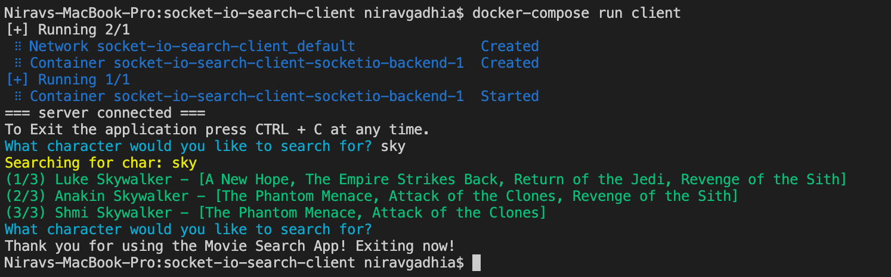

# socket-io-search-client
This is the demo porject by using the socket io node.js client to search movies by chracter

# Getting Started

You will need a Docker and Docker-compose installed in your system

If you want to test this application without installing any other developer tools run 
```
docker-compose run client
```

This will start the required backend service that you will for the client to connect. Once both client and backend service starts it will prompt you for the search query.

Here's the sample output



Once you are done press CTRL+C to exit out of the cli. To clean up run 
```
docker-compose down
```

# Running the application using npm/node

In case you want to test the application without docker-compose you have to run following command to bring up the backend in terminal

```
docker run -p 3000:3000 clonardo/socketio-backend
```

Once backend is initiated run
```
npm install
node search-client.js
```

# Building and Deploying Docker image

* Set `DOCKER_IMAGE_TAG` with a version you want to tag the new build as (default is latest). Optionally you may want to set or change 
other values in [.env](./.env) based on your account
* Log in with `docker login` to an account that has access to the destination repos specified by the image names in [docker-compose.yml](./docker-compose.yml) 
* Build the images using `docker-compose build`
* Push the images using `docker-compose push`

```
export DOCKER_IMAGE_TAG=2.0
docker login
docker-compose build
docker-compose push
```